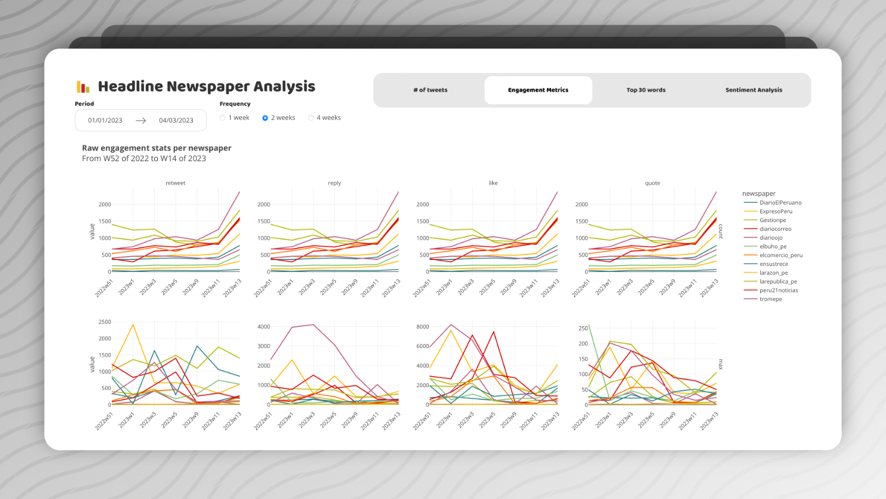

# NLP Newspapers Dashboard

[][license]
[][tests]
[][pre-commit]
[][black]

A dashboard to analyse the history and performance of Newspapers Headlines from
Perú. The headlines were pulled from Twitter's API, from Week 29 of 2022 up
until Week 9 of 2023.

## Features

- Histogram with distribution of tweets posted
- Main analytic metrics (likes, quotes, replies, retweets)
- Unique words in relation to number fo tweets
- See the most used words and their change in time
- Sentiment Analysis for tweets

## License

Distributed under the terms of the [GPL 3.0 license][license],
_NLP Newspapers Dashboard_ is free and open source software.

## Issues

If you encounter any problems,
please [file an issue] along with a detailed description.

## Credits

This project was generated from [@cjolowicz]'s [Hypermodern Python Cookiecutter]
template.

<!-- github-only -->

[@cjolowicz]: https://github.com/cjolowicz
[black]: https://github.com/psf/black
[file an issue]: https://github.com/drearondov/nlp-newspapersDashboard/issues
[hypermodern python cookiecutter]: https://github.com/cjolowicz/cookiecutter-hypermodern-python
[license]: https://github.com/drearondov/nlp-newspapersDashboard/blob/main/LICENSE
[pre-commit]: https://github.com/pre-commit/pre-commit
[tests]: https://github.com/drearondov/nlp-newspapersDashboard/actions?workflow=Tests
